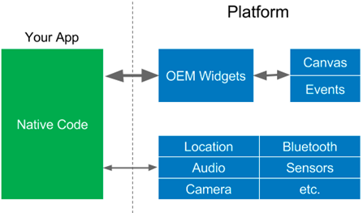
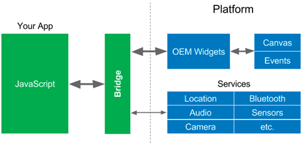
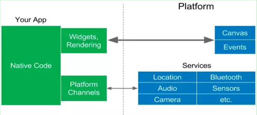
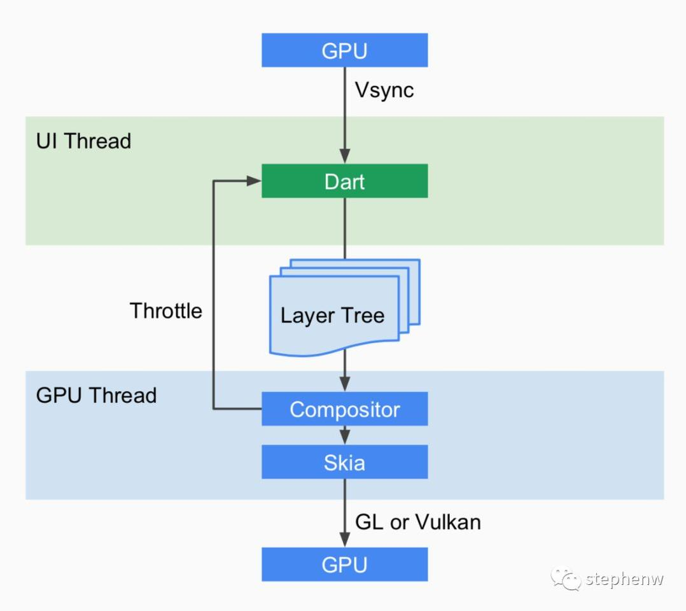
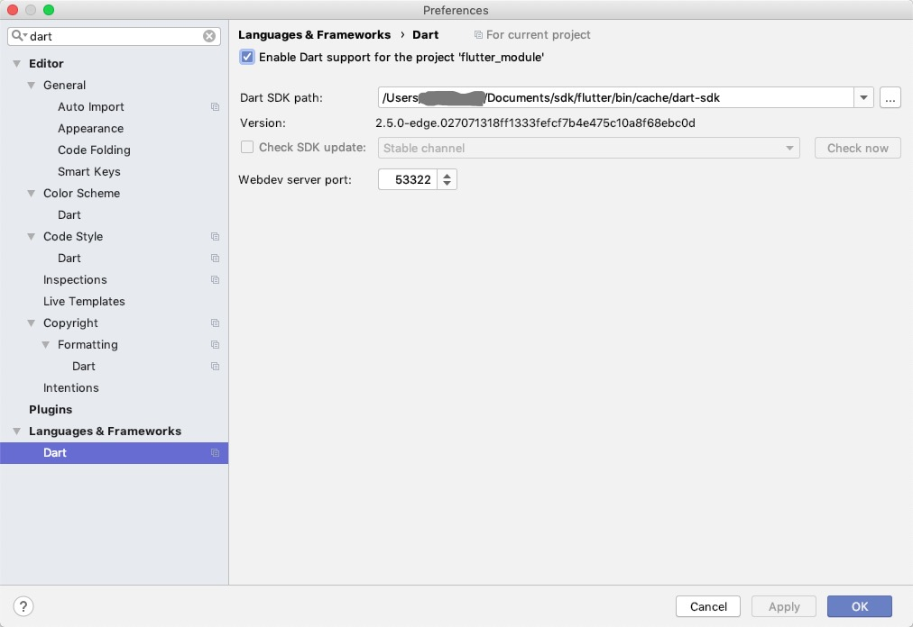
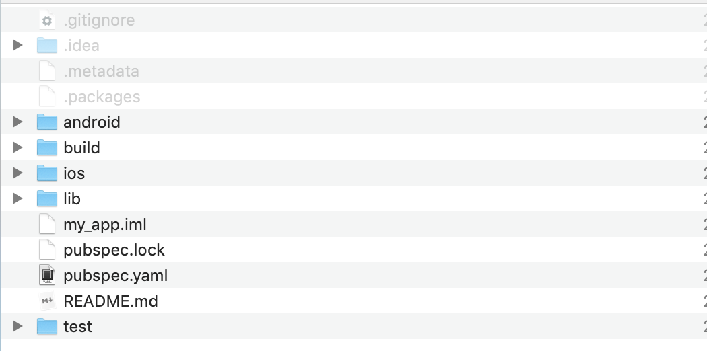
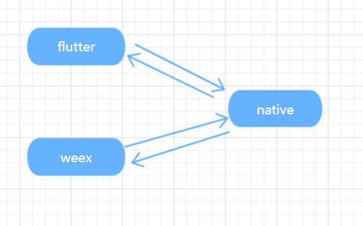
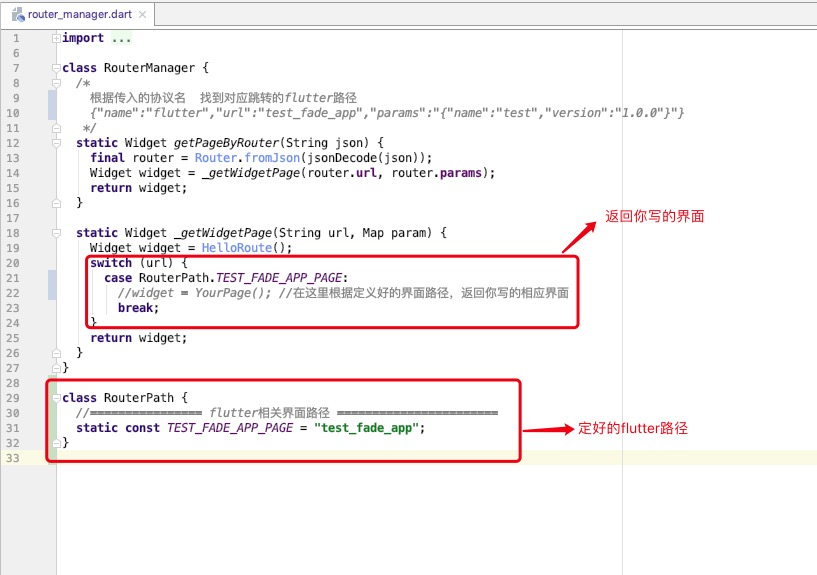

# Flutter 初体验  

## 为何使用
### 前言
针对原生开发面临的问题，人们一直都在努力寻找好的解决方案，时至今日，已经有很多跨平台框架(主要指Android和iOS两个平台)，根据其原理，主要分为三类：
* H5+原生（Cordova、Ionic、微信小程序）
* JavaScript开发 + 原生渲染 （React Native、Weex）
* 自绘UI+原生(Flutter)

针对以上几种跨平台的方案，每个框架都有其优缺点，在我们的项目中，也都曾尝试过，也踩过无数的坑。近期爱收入开发天团初体验了flutter并成功上线，发现了它的美，迫不及待地分享给大家。
### weex的不足
* 学习资料少
> Weex 的学习资料比较少。而RN使用的开发者比较多, 社区活跃，围绕react产生了许多开发框架。
这一点，个人认为是weex最大的缺点，甚至是weex能不能很好发展下去的关键因素.
* 社区活跃度不够
> Weex 相较于 RN 起步比较晚，Weex目前社区主要由阿里人员在维护, 相较于已经成熟的RN社区目前还有很多不足。用的人相对RN少很多，目前没有形成一个良好的生态。作为开发者，如果碰到一个问题，搜索不到，抛出去也没人很好的解答，自己摸索的成本就会很高了。 可能解决一个问题的成本就已经远远大于节省下来的一点学习成本。
* 界面的设配精度不够
> Weex进行界面适配的时候是用750为标准的，所以需要根据750去换算，换算的过程中会进行四舍五入，所以会产生精度不足。
* 对常用的断点调试支持不足
* 不支持热重载
* 官方对于动画的支持非常薄弱
* weex每次更新都会出现较严重的设配问题

### Flutter优点
1. 性能强大，流畅
> Flutter对比weex和react native相比，性能的强大是有目共睹的。对于weex，react native，主要基于dom树渲染原生组件，很难与直接在原生视图上绘图比肩性能，Google作为一个轮子大厂，直接在两个平台上重写了各自的UIKit，对接到平台底层，减少UI层的多层转换，UI性能可以比肩原生，这个优势在滑动和播放动画时尤为明显。
2. 路由设计优秀。
> Flutter的路由传值非常方便，push一个路由，会返回一个Future对象（也就是Promise对象），使用await或者.then就可以在目标路由pop，回到当前页面时收到返回值。这个反向传值的设计基本是甩了微信小程序一条街了。弹出dialog等一些操作也是使用的路由方法，几乎不用担心出现传值困难
3. 优秀的动画设计。
> Flutter的动画简单到不可思议，动画对象会根据屏幕刷新率每秒产生很多个（一般是60个）浮点数，只需要将一个组件属性通过补间（Tween）关联到动画对象上，Flutter会确保在每一帧渲染正确的组件，从而形成连贯的动画。这种十分暴力的操作在Flutter上却看不到明显的卡顿，这也是Flutter的一个魔力所在。相比之下其他跨平台框架几乎不能设计动画……往往会遭遇非常严重的性能问题。
4. UI跨平台稳定。
> Google直接在两个平台上在底层重写了UIKit，不依赖于Css等外部解释器，几乎不存在UI表达不理想，渲染不正常的情况，可以获得非常稳定的UI表达效果。Css换个浏览器就有不同的表现，基于Css的跨平台框架很难获得稳定的UI表现。
5. 可选静态的语言，语言特性优秀
> Dart是一个静态语言，这也是相对于js的一个优势。Dart可以被编译成js，但是看起来更像java。静态语言可以避免错误，获得更多的编辑器提示词，极大的增加可维护性。很多js库也已经用ts重写了，Vue3.0的底层也将全部使用ts编写，静态语言的优势不言而喻。
6. 支持热重载

* [引用地址](https://www.jianshu.com/p/c51fc925bfd1)
### Flutter架构简介
* 传统的原生开发使用Native语言和Platform进行交互，通过调用平台API来实现App的功能。




* RN通过JS访问平台UI组件，所以需要通过Bridge桥接器将JS转换到原生，在UI被频繁操作时可能导致性能问题。



* 为避免JS桥接器的性能问题，Flutter采用Dart语言，Dart使用预编译的方式编译多个平台的原生代码，这允许Flutter直接与平台通信，而不需要通过执行上下文切换的JS桥接器。Flutter的UI组件和渲染器都从平台中移到了到用户的应用程序，所以虚拟机中的控件树是真实的控件树，渲染速度快。Dart程序和执行数据编解码的平台之间仍然有个接口，但这个接口的速度比JSBridge高出几个数量级。



* 绘制原理
> 我们都知道显示器以固定的频率刷新，比如 iPhone的 60Hz、iPad Pro的 120Hz。当一帧图像绘制完毕后准备绘制下一帧时，显示器会发出一个垂直同步信号（VSync），所以 60Hz的屏幕就会一秒内发出 60次这样的信号。 并且一般地来说，计算机系统中，CPU、GPU和显示器以一种特定的方式协作：CPU将计算好的显示内容提交给 GPU，GPU渲染后放入帧缓冲区，然后视频控制器按照 VSync信号从帧缓冲区取帧数据传递给显示器显示。
所以，Android、iOS的 App在显示 UI时是如此，Flutter也不例外，也遵循了这种模式。所以从这里可以看出 Flutter和 React-Native之众的本质区别：React-Native之类只是扩展调用 OEM组件，而 Flutter是自己渲染。 在 Flutter Architecture的解释中，Google还提供了一张更为详尽的图来解释 Flutter的原理：




> 这张图解释得更清晰一些：Flutter只关心向 GPU提供视图数据，GPU的 VSync信号同步到 UI线程，UI线程使用 Dart来构建抽象的视图结构，这份数据结构在 GPU线程进行图层合成，视图数据提供给 Skia引擎渲染为 GPU数据，这些数据通过 OpenGL或者 Vulkan提供给 GPU。
所以 Flutter并不关心显示器、视频控制器以及 GPU具体工作，它只关心 GPU发出的 VSync信号，尽可能快地在两个 VSync信号之间计算并合成视图数据，并且把数据提供给 GPU。


### 各框架特点汇总

  比较内容|React Native|Weex|Flutter|
  --|:--:|--:|--:|
  平台实现|JavaScript|JavaScript|无桥接、原生编码|
  引擎|JS V8|JSCore |Flutter engine|
  核心语言|React|Vue|Dart|
  Apk大小|7.6M|10.6M|8.1M|
  bundle文件大小|默认单一，较大|较小，多页面可多文件|一般|
  上手难度|稍高|容易|一般|
  架构程度|较重|较轻|重|
  特点|适合开发整体App|适合单页面|适合开发整体App|
  社区|丰富，facebook重点维护|有点残念，托管apache|刚出道的小鲜肉，拥护者众多|
  支持|Android,iOS|Android,iOS|Android,iOS,web?|


## weexBox中使用flutter
### 安装环境
* [flutter SDK安装](https://flutter.dev/docs/get-started/install)
* 根据flutter官网配置环境变量 
### 创建项目
* weexBox可以通过命令行创建包含weex与flutter的混合项目：

``` bash
# 新建一个weex和flutter混合工程
weexbox create project-name -f
```
#### 注意：
* flutter章节是基于Android studio开发环境所写

### 运行项目
运行项目之前，需要先用Android Studio打开flutter_module项目，该项目在platforms文件夹下，与Android、ios项目同级。因为原生项目需要将flutter文件打包到apk里面，需要先确保flutter项目环境没有问题。打开flutter_module项目后配置好flutter与dart安装路径，如下图：
* flutter sdk

* dart sdk

然后同步环境后运行该项目，编译一段时间后，生成apk成功（注意apk生成成功，不成功说明你的flutter环境有问题，请检查是否缺少了某个步骤），安装apk成功后，打开apk，Console将会报错，因为该flutter项目并不是一个纯项目，而是我们原生项目的一个依赖。接下来就可以直接运行原生项目。
* 项目结构
  目录与文件|说明|
  --|:--:|
  android|flutter与Android工程相关|
  ios|flutter与iOS工程相关|
  lib|flutter核心代码|
  pubspec.yaml|flutter依赖的配置文件|
  


* 配置文件 pubspec.yaml
```js
version: 1.0.0+1
// 环境，flutter的sdk版本在此之间
environment:
  sdk: ">=2.2.2 <3.0.0"
// 依赖库  
dependencies:
  flutter:
    sdk: flutter
  cupertino_icons: ^0.1.2
  flutter_spinkit: "^3.1.0"
  flutter_easyrefresh: ^1.2.7
  common_utils: ^1.1.3
// 测试环境的依赖库
dev_dependencies:
  flutter_test:
    sdk: flutter
flutter:
  uses-material-design: true
// 图片配置 weexbox refimg / weexbox refimg -d (自动创建基于配置信息的dart文件) 已实现自动导入图片配置
  assets:
     - images/icon_expert_help_1.png
     - images/icon_expert_help_2.png
     - images/icon_expert_help_3.png
```

## 原生通信
* 对于某些需要调用原生硬件的需求，flutter不可避免的需要和原生端进行通信，flutter提供了3种通信通道。在weexbox中，已经写好了通信通道，并且根据不同情况选好不同的通道。
* 核心类
  类名|说明|
  --|:--:|
  BasicMessageChannel|用于传递数据。Flutter与原生项目的资源是不共享的，可以通过BasicMessageChannel来获取Native项目的图标等资源。|
  MethodChannel|传递方法调用。Flutter主动调用Native的方法，并获取相应的返回值。比如获取系统电量，发起Toast等调用系统API，可以通过这个来完成。|
  EventChannel|传递事件。这里是Native将事件通知到Flutter。比如Flutter需要监听网络情况，这时候MethodChannel就无法胜任这个需求了。EventChannel可以将Flutter的一个监听交给Native，Native去做网络广播的监听，当收到广播后借助EventChannel调用Flutter注册的监听，完成对Flutter的事件通知|

### flutter调用原生提供的方法
需要原生端先提供方法的实现，再在flutter进行调用。
* 原生提供方法

  建议使用者在继承WBFlutterActivity的基类Activity中重写以下方法，或者在WBFlutterActivity中直接修改。
```js
 // 子类重载此方法，就可以添加自己的method
    open fun flutterMethodCall(call: MethodCall, result: MethodChannel.Result) {
        val method = call.method
        val arguments = call.arguments as? Map<String, Any> ?: TreeMap<String, Any>()
        when (method) {
            "methodName" -> {
                result.success("")
            }
        }
    }
```
* flutter调用原生方法

```js
ChannelManger.methodChannel
        .invokeMethod('methodName';//methodName是与原生端一起定好的方法名
```


## weexBox通信
由于weexBox中使用了weex与flutter，为了统一weex，flutter，native三端的通信，我们提供了以下解决方案。

* 路由的跳转
在weexBox中跳转flutter界面同样采用路由的方式，并且与原来的路由跳转没有区别，只需要将router.name改为flutter，url传入flutter模块中定好的flutter路径。
* 先在RouterManager定义flutter路径


* flutter页面跳转flutter
```js
  var router = Router();
  router.name = Router.nameFlutter;//Router.nameFlutter = "flutter"
  router.url = 'test_fade_app';
  router.params = {"sss":"sss"};
  router.navBarHidden = true;
  router.open();
```
* weex页面跳转flutter
```js
  native.router.open({
            name: 'flutter',
            // 隐藏导航栏
            navBarHidden: true,
            url: 'test_fade_app',
            params: {
              from: 'modify',
            },
          })
```
* 事件通知
weexbox中的flutter、weex和native都支持全局事件通知， 任一端注册事件，任一端发送事件。下面是flutter的注册事件和发送事件，weex的事件注册与通知请查看weex章节。
```js
  // 发送事件
   Event.emit('eventName', {'k': 'vbbbb'});
  // 注册事件
  Event.register('eventName', (event) {
                //print(event); 
              });
  // 注销事件
  Event.unregister("eventName");
  // 注销当前页面全部事件
  Event.unregisterAll();
```  


