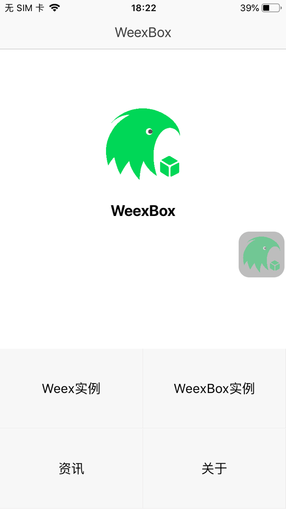
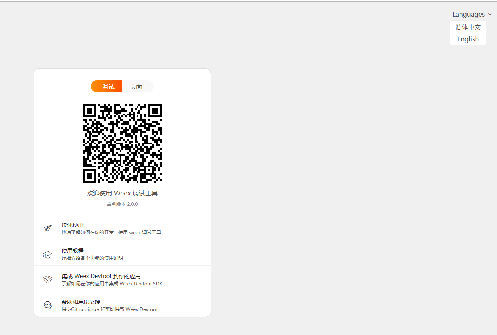
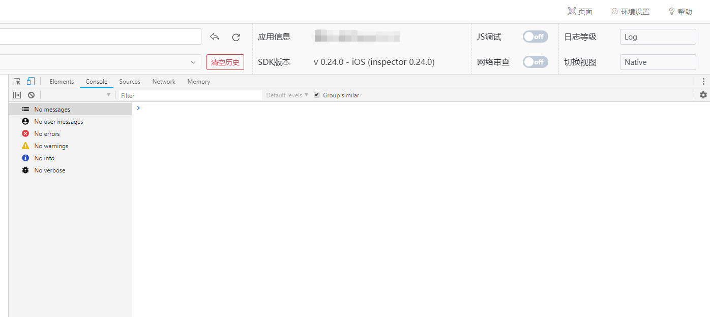

# 升级2.0.x版本指引

升级weexbox 2.0.x 使用指引

- 更新到weexbox 2.0.x 版本后，debug界面的ui发生重大变化。

## @weexbox/cli

``` bash
# 安装cli
cnpm i -g @weexbox/cli

# 新建一个weex工程
weexbox create project-name
# 或者
# 新建一个weex和flutter混合工程
weexbox create project-name -f

# 进入工程
cd project-name

# 安装依赖
cnpm i

# 开始写bug
```

查看package.json，可以看到新增了许多命令：

``` js

"develop": "weexbox-service build develop",
"test": "weexbox-service build test",
"preRelease": "weexbox-service build preRelease",
"release": "weexbox-service build release",
"watchDevelop": "weexbox-service watch develop",
"watchTest": "weexbox-service watch test",
"watchPreRelease": "weexbox-service watch preRelease",
"watchRelease": "weexbox-service watch release",
"debug": "weexbox-service debug",
"lint": "eslint --fix --ext .js,.vue src",

```

<!-- develop: 构建开发包
test：单元测试
preRelease：构建预发布包
release：构建开发包
watchDevelop：开发weex页面，下面将详解
debug：开启debug页面，在命令watch中已经开启，无需再次打开
lint：代码格式化，统一风格，优化代码结构 -->

## npm run watchDevelop

开发时，我们主要使用watchDevelop命令，其它命令可自行尝试。

初始化的项目里已经内置了 @weexbox/service，它负责调试功能。

在`src`下建立业务模块，根据给定的[项目结构](https://aygtech.github.io/weexbox/guide/project.html)，建立自己的页面结构。

例如：建立一个HelloWorld页面，我们建立的结构为：


在`HelloWorld/index`文件夹中，`App.vue`以及`index.js`名字保持不变，`App.vue`中就是我们自己页面的逻辑内容，可**参考***src/page/home/App.vue*建立结构，`index.js`中的内容**复制***src/page/home/index.js*中的即可。

刚刚在`App.vue`中书写的代码，我们如何能在app中查看到效果呢？

在项目结构中，运行命令 **npm run watchDevelop**

例如：

```sh

# 代码
npm run watchDevelop

```

代码编辑器中，会输入如下所示：


**打开我们自己生成的app（apk或ipa），如图所示**



点击右边的浮层按钮，点击照相icon，打开摄像头，扫描浏览器打开的页面：



iOS扫描后界面为：



Android扫描后界面为：(因渲染方式不同，Android会自动打开js调试模式，iOS不需要；在日志等级中，Android默认设置为debug，需要手动调整为log模式，即可查看输入日志了。)


手机端进入weex页面，随意更改页面内容，就可以看到页面中的输出了。

自此，我们将手机跟pc联系起来了，我们就能将本地书写的页面在app上预览调试了。

::: danger
确保电脑与手机处于同一网段。
:::

## @weexbox/service

初始化的项目里已经内置了 @weexbox/service，它负责打包功能。

编译打包热更新一条龙服务

```sh
# 开发环境
npm run develop

# 测试环境
npm run test

# 准生产环境
npm run preRelease

# 生成环境
npm run release
```

这个步骤会

- 生成一份内置包到app中，你可以再次构建打包生成app。
- 生产一份更新包deploy，你可以将它部署到nginx。
