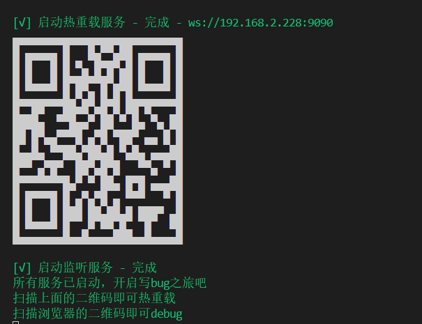
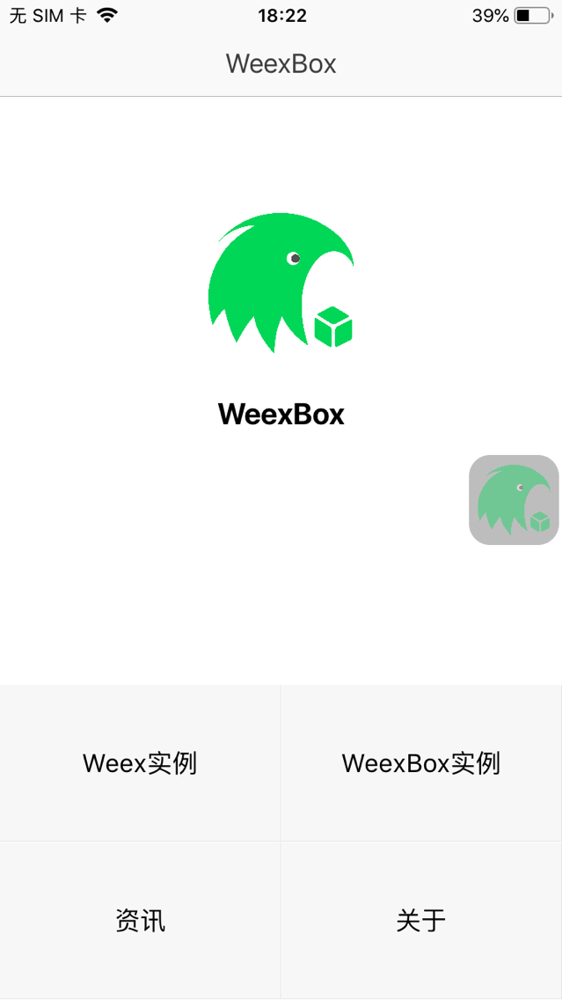
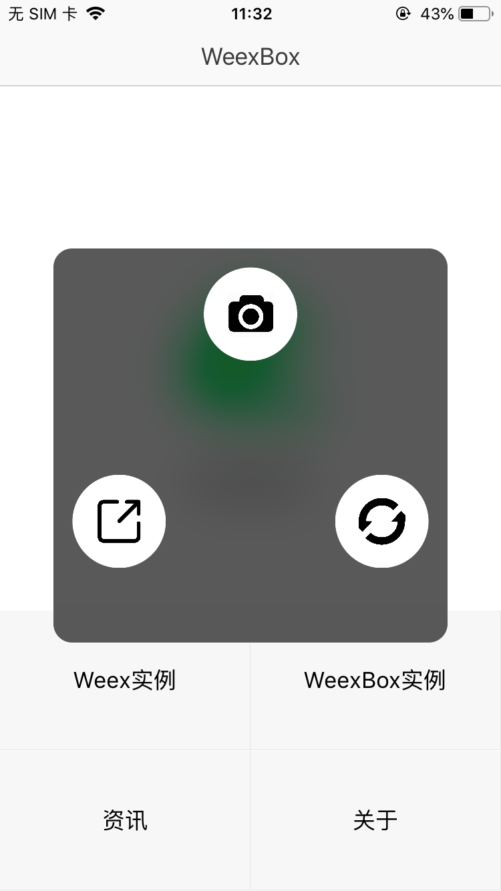
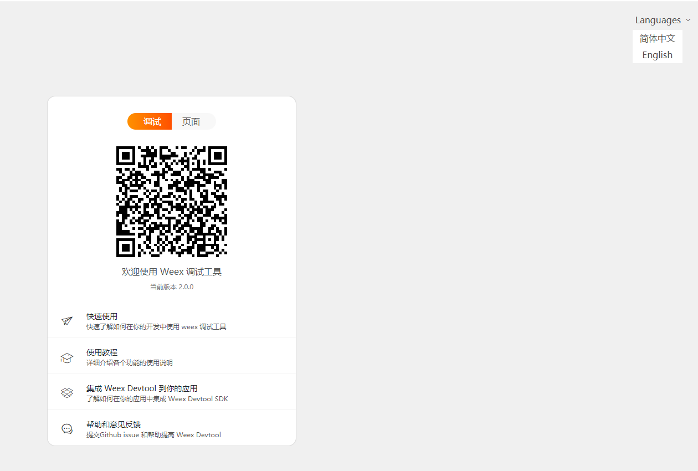
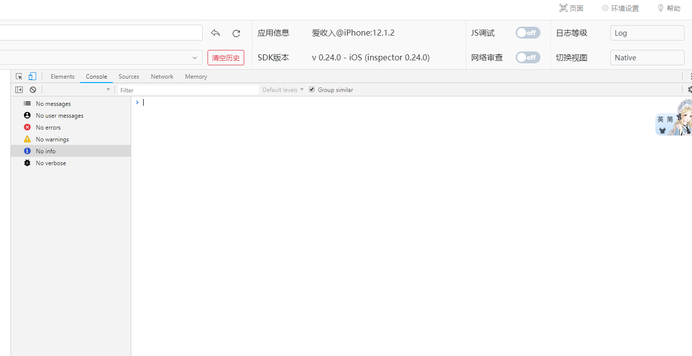
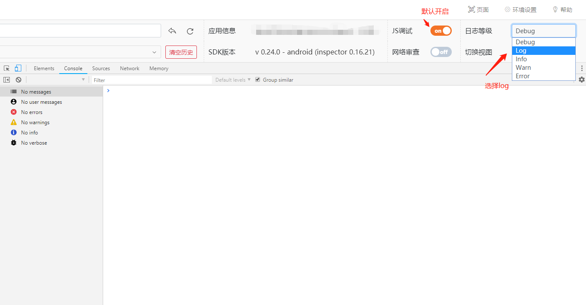
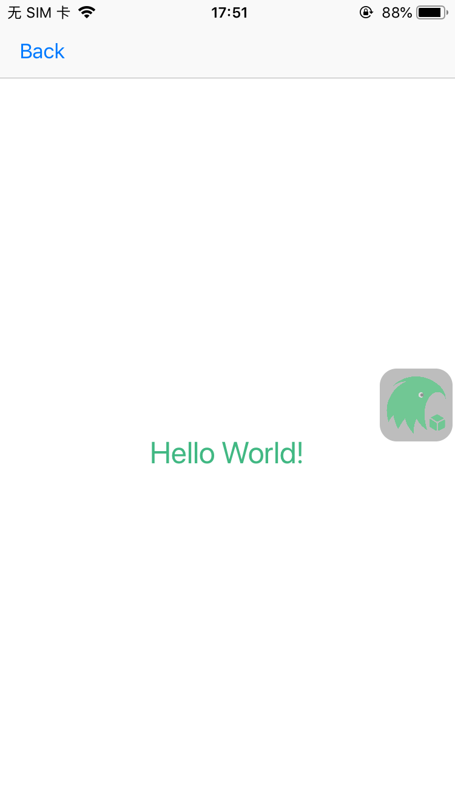
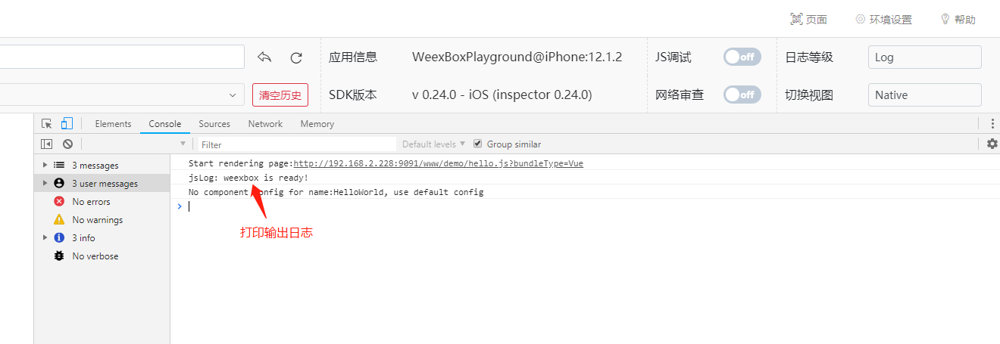
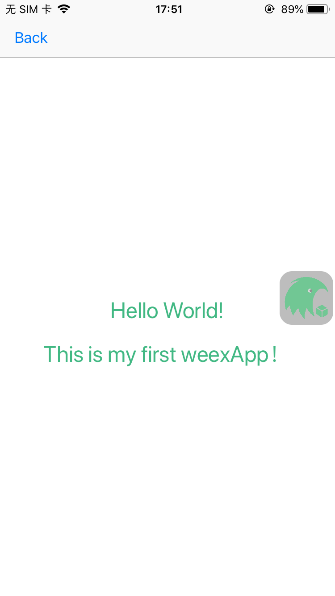
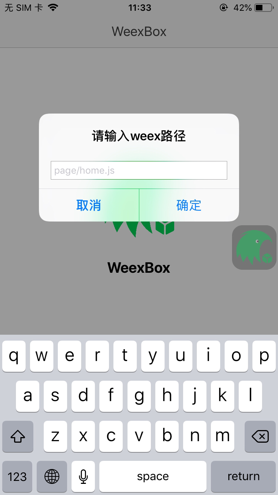

# Hello World

以此为例

- 说明如何创建页面到app中？
- 如何调试当前开发的页面？
- 如何打包构建app？

## @weexbox/cli

使用命令cnpm i -g @weexbox/cli 升级weexbox/cli到最新版，使用下面命令创建项目结构

``` bash
# 安装cli
cnpm i -g @weexbox/cli

# 新建一个weex工程
weexbox create project-name
# 或者
# 新建一个weex和flutter混合工程
weexbox create project-name -f

# 进入工程
cd project-name

# 安装依赖
cnpm i

# 开始写bug
```

安装依赖后，项目的结构[如下](https://aygtech.github.io/weexbox/guide/project.html)

```
.
├── config                  // 配置文件夹
│   ├── update-config.json  // 热更新的配置文件
│   └── weexbox-config.js   // 图片资源的配置文件
├── deploy                  // 输出文件夹，自动生成
│   ├── 20190103153502      // js bundle文件夹
│   │   └── module          // 模块文件夹
│   │       └── page.js     // js bundle
│   ├── static              // 图片资源
│   └── update-version.txt  // 打包时间戳
├── platforms               // 原生文件夹
│   ├── android             // Android工程
│   └── ios                 // iOS工程
├── src                     // vue源码文件夹
│   └── module              // 模块文件夹。名字根据项目而定
│       └── page            // 页面文件夹。名字根据项目而定
│           ├── App.vue     // vue源码
│           └── index.js    // 入口文件
└── static                  // 图片资源文件夹
```

在工程结构`platforms`文件夹中，会看到两个文件夹`android`、`ios`。  
Android 端使用 Android Studio 开发工具，导入 `platforms/android` 文件夹，构建打包生成项目的apk。  
iOS 端先使用CocoaPods安装依赖，再用 Xcode 开发工具导入 `platforms/ios` 文件夹，构建打包生成项目的ipa。

## @weexbox/service

初始化的项目中已经内置了 @weexbox/service，替换原来的 @weexbox/builder 和 @weexbox/debugger ，增加全局热重载模式。

在`src`下建立业务模块，根据给定的项目结构，建立自己的页面结构：

例如：建立一个HelloWorld页面，我们建立的结构为：


在`HelloWorld/index`文件夹中，`App.vue`以及`index.js`名字保持不变，`App.vue`中书写我们的业务逻辑，可**参考** *src/page/home/App.vue* 建立结构，`index.js`中的内容**复制** * src/page/home/index.js *中的即可。

刚刚在`App.vue`中书写的代码，我们如何能在app中查看到效果呢？

在项目结构中，使用 **npm run watchDevelop**

例如：

```sh
# 代码
npm run watchDevelop
```

::: danger
在src下创建页面后，需要重新运行 **npm run watchDevelop**
:::

代码编辑器中，会打印如下所示：



**打开我们自己生成的APP（apk或ipa），如图所示**



点击右边的浮层，浮层按钮，如下所示：



点击右边的浮层按钮，点击照相icon，打开摄像头，扫描浏览器打开的页面：



iOS扫描后界面为：



Android扫描后界面为：(因渲染方式不同，Android会自动打开js调试模式，iOS不需要；在日志等级中，Android默认设置为debug，需要手动调整为log模式，即可查看输入日志了)



手机端为：



当调整，src/HelloWorld/index/App.vue中的代码时，增加“This is my first weexApp！”,保存后，页面会自动刷新同时app中的页面也会刷新。




当我们想调试某个页面时，点击APP中的悬浮窗中的分享icon，出现如下界面：



这时输入想要调试的页面路径，即可！

随后，就可以愉快的开发了，“海阔凭鱼跃，天高任鸟飞”。

::: danger
确保电脑与手机处于同一网段。
:::

## 项目构建

初始化的项目里已经内置了 @weexbox/service，它负责打包功能。

编译打包热更新一条龙服务

这时会：

- 生成一份内置包到app中，你可以再次构建打包生成app。
- 生产一份更新包deploy，你可以将它部署到nginx。

```sh
# 开发环境
npm run develop

# 测试环境
npm run test

# 准生产环境
npm run preRelease

# 生成环境
npm run release
```
