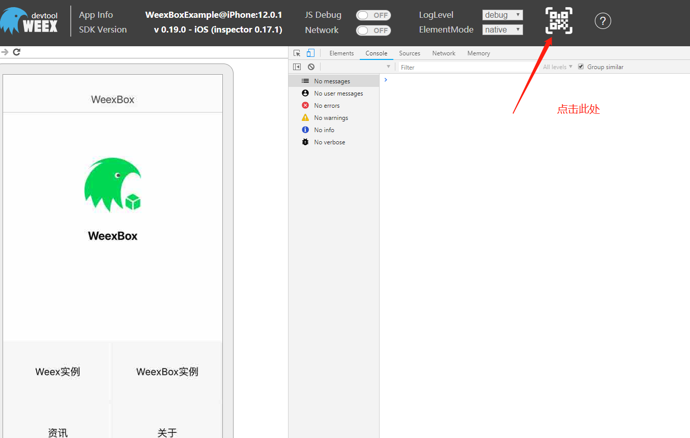

# Hello World

以此为例

- 说明如何创建页面到app中？
- 如何调试当前开发的页面？
- 如何打包构建app？

## @weexbox/cli

```sh
# 安装
cnpm i -g @weexbox/cli

# 新建一个weex工程
weexbox create project-name

# 进入工程
cd project-name

# 安装依赖
cnpm i

```

安装依赖后，项目的结构[如下](https://aygtech.github.io/weexbox/guide/project.html)

```sh
.
├── config                  // 配置文件夹
│   ├── update-config.json  // 热更新的配置文件
│   └── weexbox-config.js   // 图片资源的配置文件
├── deploy                  // 输出文件夹，自动生成
│   ├── 20190103153502      // js bundle文件夹
│   │   └── module          // 模块文件夹
│   │       └── page.js     // js bundle
│   ├── static              // 图片资源
│   └── update-version.txt  // 打包时间戳
├── platforms               // 原生文件夹
│   ├── android             // Android工程
│   └── ios                 // iOS工程
├── src                     // vue源码文件夹
│   └── module              // 模块文件夹。名字根据项目而定
│       └── page            // 页面文件夹。名字根据项目而定
│           ├── App.vue     // vue源码
│           └── index.js    // 入口文件
└── static                  // 图片资源文件夹

```

在工程结构`platforms`文件夹中，会看到两个文件夹`android`、`ios`。  
Android 端使用 Android Studio 开发工具，导入 `platforms/android` 文件夹，构建打包生成项目的apk。  
iOS 端先使用CocoaPods安装依赖，再用 Xcode 开发工具导入 `platforms/ios` 文件夹，构建打包生成项目的ipa。

## @weexbox/debugger

初始化的项目里已经内置了 @weexbox/debugger，它负责调试功能。

在`src`下建立业务模块，根据给定的项目结构，建立自己的页面结构：

例如：建立一个HelloWorld页面，我们建立的结构为：


在`HelloWorld/index`文件夹中，`App.vue`以及`index.js`名字保持不变，`App.vue`中就是我们自己页面的逻辑内容，可**参考***src/page/home/App.vue*建立结构，`index.js`中的内容**复制***src/page/home/index.js*中的即可。

刚刚在`App.vue`中书写的代码，我们如何能在app中查看到效果呢？

在项目结构中，使用*npm run debug [vue/weex页面的路径]*

例如：
```sh
# 代码
npm run debug src/HelloWorld/index/App.vue
```

浏览器会自动打开一个界面，如下：


**打开我们自己生成的app（apk或ipa），如图所示**


点击右边的浮层，浮层按钮，如下所示：


点击照相icon，打开摄像头，扫描上面浏览器打开的页面，出现如下界面，点击如图所示位置：


再次打开app中的扫码功能，扫描刚点击后出现的二维码，如下图：


扫码以后，界面为：


手机端为：


自此，我们将手机跟pc联系起来了，我们就能将本地书写的页面在app上预览调试了。

当我调整，src/HelloWorld/index/App.vue中的代码时，增加“This is my first weexApp！”,保存后，页面会自动刷新同时app中的页面也会刷新。


随后，就可以愉快的开发了，“海阔凭鱼跃，天高任鸟飞”。

::: danger
确保电脑与手机处于同一网段。
:::

## @weexbox/builder

初始化的项目里已经内置了 @weexbox/builder，它负责打包功能。

开发完代码，运行npm run develop

```sh
# 开发环境
npm run develop

# 测试环境
npm run test

# 准生产环境
npm run preRelease

# 生成环境
npm run release
```

这个步骤会
- 生成一份内置包到app中，你可以再次构建打包生成app。
- 生产一份更新包deploy，你可以将它部署到nginx。
